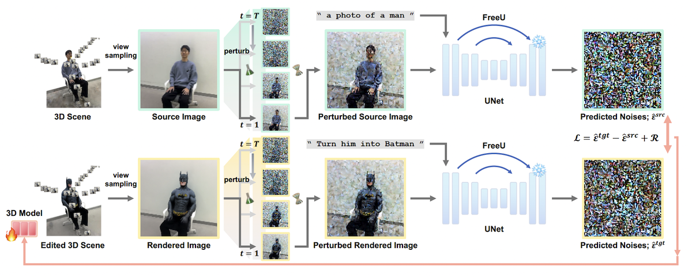

<h1 align="center">

DreamCatalyst: Fast and High-Quality 3D Editing via Controlling Editability and Identity Preservation
</h1>
<h4 align="center">
Authors Anonymized
</h4>


<br/>

## Introduction


DreamCatalyst is a novel framework that considers the sampling dynamics of diffusion models in the SDS(Score Distillation Sampling) framework. DreamCatalyst can be applied to various models in 3D editing, such as NeRF and 3DGS. Please refer to our paper for more details.

<br/>

## Architecture


<br/>

## Setup

### Installation

First, create and activate a new virtual(conda) environment.

```bash
conda create -n dreamcatalyst python=3.9
conda activate dreamcatalyst
```

Then, install the required packages.

```bash
pip install torch==2.1.2+cu118 torchvision==0.16.2+cu118 --extra-index-url https://download.pytorch.org/whl/cu118
conda install -c "nvidia/label/cuda-11.8.0" cuda-toolkit
pip install ninja git+https://github.com/NVlabs/tiny-cuda-nn/#subdirectory=bindings/torch
pip install -e .
```

For 3D editing with DreamCatalyst, you need to install the following packages.

```bash
cd 3d_editing
pip install -e .
pip install numpy==1.26.4
pip install gsplat==0.1.6
```

You should be able to see `dc` and `dc_splat` if the installation is successful in the following command.

```bash
cd ..
ns-train -h
```

<br/>

### Dataset

Please download the dataset from the following link and extract it to the `dataset` directory.

> PDS provides image data for 3D scene. Please download the dataset [here](https://1drv.ms/f/s!AtxL_EOxFeYMk3rftsoc4L8cg0VS?e=Hhbprk). 
This dataset is a subset of the 3D scene data from [Instruct-NeRF2NeRF](https://instruct-nerf2nerf.github.io/). You do not need to download Dreambooth checkpoints since our method does not require them.


<br/>

## RUN

Our codes are based on [Nerfstudio](https://docs.nerf.studio/) framework. We follow the same training procedure as the PDS except for refinement stage.

### Initialize 3D Scenes

<b>NeRF</b>

```bash
ns-train nerfacto --data dataset/{dataset_name} --pipeline.model.use_appearance_embedding False

# Example
ns-train nerfacto --data dataset/yuseung --pipeline.model.use_appearance_embedding False
```

<b>3DGS</b>

```bash
ns-train splatfacto --data dataset/{dataset_name}

# Example
ns-train splatfacto --data dataset/yuseung
```

You can see that the outputs are saved in the `outputs/{dataset_name}/{model_name}/{timestamp}` directory. (e.g., `outputs/yuseung/nerfacto/2024-10-02_000000`)


<br/>

### Edit 3D Scenes

<b>NeRF</b>

```bash
ns-train dc --data dataset/{dataset_name} --load-dir outputs/{dataset_name}/{model_name}/{timestamp}/nerfstudio_models/ \
 --pipeline.dc.src_prompt "a photo of a man" \
 --pipeline.dc.tgt_prompt "Turn him into a Batman" \
 --vis viewer \
 --max_num_iterations 3000 \
 --pipeline.dc.freeu_b1 1.1 \
 --pipeline.dc.freeu_b2 1.1 \
 --pipeline.dc.freeu_s1 0.9 \
 --pipeline.dc.freeu_s2 0.2 \
 --pipeline.dc.sd_pretrained_model_or_path timbrooks/instruct-pix2pix
```

You can use the <u>fast mode</u> by setting `max_num_iterations 3000` to `max_num_iterations 1000`.


<b>3DGS</b>

```bash
ns-train dc_splat --data dataset/{dataset_name} --load-dir outputs/{dataset_name}/{model_name}/{timestamp}/nerfstudio_models/ \
 --pipeline.dc.src_prompt "a photo of a man" \
 --pipeline.dc.tgt_prompt "Turn him into a Batman" \
 --vis viewer \
 --max_num_iterations 3000 \
 --pipeline.dc.freeu_b1 1.1 \
 --pipeline.dc.freeu_b2 1.1 \
 --pipeline.dc.freeu_s1 0.9 \
 --pipeline.dc.freeu_s2 0.2 \
 --pipeline.dc.sd_pretrained_model_or_path timbrooks/instruct-pix2pix
```

<br/>

## Important Files

```
3d_editing/dc_nerf/pipelines/dc_pipeline.py
3d_editing/dc_nerf/dc_config.py
dc/dc.py
dc/dc_unet.py
dc/utils/free_lunch.py
```